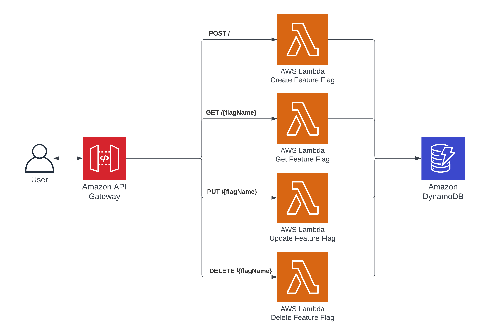

# AWS Simple Serverless Feature Flag Service

This repo contains an AWS Serverless application using CDK to define the Infrastructure, written in C#. This defines an application that will deploy an API and CRUD code to allow feature flags to be created, retrieved, updated and delete using DynamoDB as storage.

## Overview

## Flow

Each action on the api has basic validation which includes verifying the flagNAme is in the the path and that flagName and value are in the request body where applicable.

### Create
1. User creates a feature flag via the api using a POST request
2. API Gateway invokes a lambda using a proxy integration
3. The handler of the Create lambda queries DynamoDB to ensure flag does not exist, if it does an error is returned.
4. If flag does not exist feature flag name and value is saved in DynamoDB

### Retrieve
1. User retrieves a feature flag via the api using a GET request
2. API Gateway invokes a lambda using a proxy integration
3. The handler of the Get lambda queries DynamoDB to retrieve the flag.
4. If flag does not exist an error is returned otherwise a successful response including name and value are returned.

### Update
1. User updates a feature flag via the api using a PUT request
2. API Gateway invokes a lambda using a proxy integration
3. The handler of the Update lambda queries DynamoDB to ensure flag exists, if it does not exist an error is returned.
4. If flag does exist feature flag value is updated and saved in DynamoDB

### Delete
1. User deletes a feature flag via the api using a DELETE request
2. API Gateway invokes a lambda using a proxy integration
3. The handler of the Delete lambda queries DynamoDB to ensure flag exists, if it does not an error is returned.
4. If flag does exist feature flag is deleted from DynamoDB.

## Deployment

The `cdk.json` file contains the information needed for the CDK Toolkit to execute your app.

Running the deploy.bat will deploy this application.

**Beware!** This is a prototype of how a feature flag service can be ran using serverless and CDK, this is not intended for production use as this has no authentication and only basic validation.